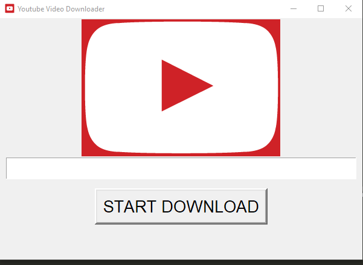

### Youtube_Downloader_GUI

## How is works 
  *** 
   * Python based Youtube video downloader ,where we have to  put link of video that we want to download , 
   * A progress bar will show the percentage the video is downloaded 
   * You can also choose the desire location.
 
## You need to know before download
   Generally the downloaded video is 720p
   
## Screenshot 
  
 
## Libray used 
***
* pytube  for downloading YouTube Videos.
* tkinter for GUI
* threading for Progress Bar

## Refrences used
  https://pytube.io/en/latest/
  https://docs.python.org/3/library/threading.html
  https://docs.python.org/3/library/tkinter.html
  
  
###### HAppy to see any changes
